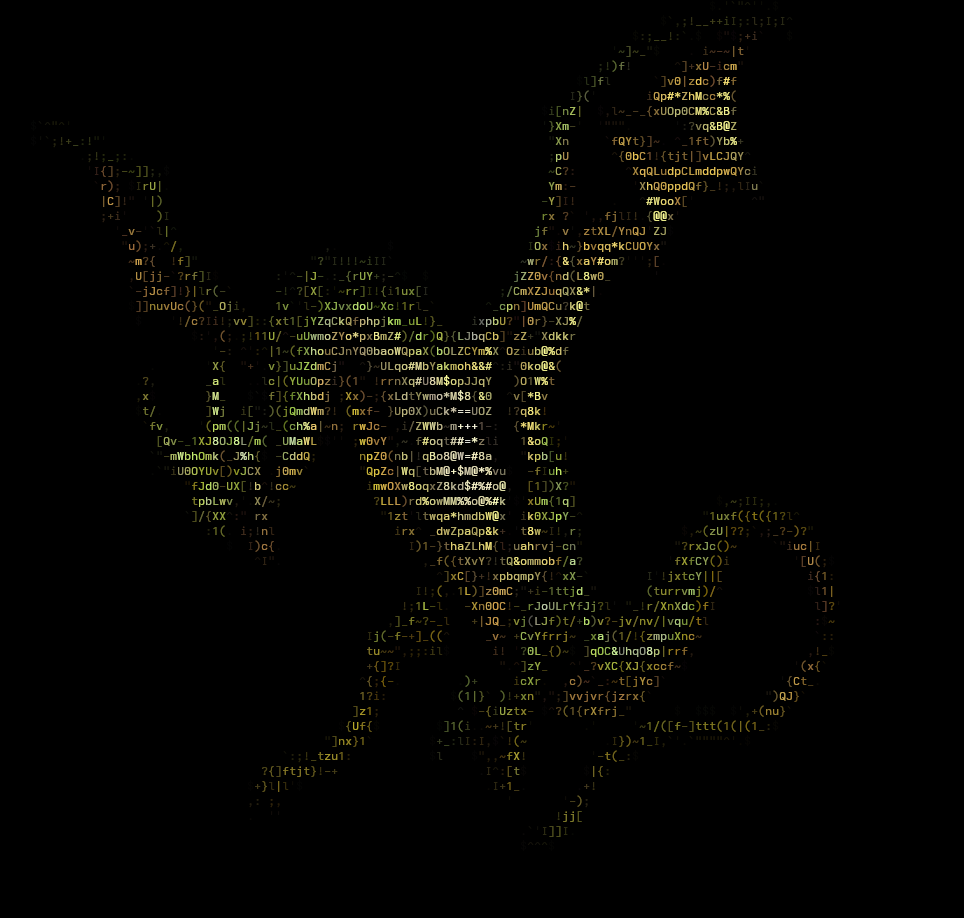

## pyASCII
A simple program I am working on for a text based RPG that converts images to ASCII using [Pillow](https://github.com/python-pillow/Pillow).

### Useage
Run in the same directory as any .jpg or .png files.